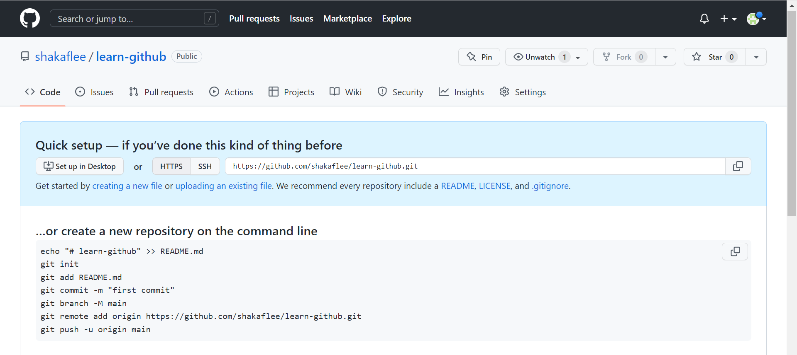

# Github Learning - create a local repo and push to remote

- **OS**: Windows 10
- **Software**: Git Bash, Visual Studio Code, 
- **Target**: Create a local repo, edit file locally, then push to remote for host.

Table of this content:

- [Step 1: Get tools handy](#step-1-get-tools-handy)
- [Step 2: Create a local repo with Git](#step-2-create-a-local-repo-with-git)
- [Step 3: Add this repo to Github using Git](#step-3-add-this-repo-to-github-using-git)

## Step 1: Get tools handy

First we need know the **difference** between Git Bash and Git CMD, or even Git GUI.

- Git Bash
>emulates a bash environment on windows. It lets you use all git features in command line plus most of standard unix commands. Useful if you are used to Linux and want to keep the same habits.

- Git CMD
>like regular Windows command prompt with the git command. It lets you use all of Git features through command line. Useful if you are already familiar with Windows cmd and you only work on Windows.

- Git GUI
>a Graphical User Interface letting you use Git without touching command line. It is an alternative among other Git clients.

Now as I know this, so when I face installation Git on my computer, I choose only use Git in Git Bash because I want to try unix style though I don't even konw windows CMD right now.

This is why the tool I use is Git Bash, not Git CMD.

Download the latest version of Git for windows at https://git-scm.com/downloads

Download the latest version of Visual Studio Code for windows at https://code.visualstudio.com/Download

## Step 2: Create a local repo with Git

I want to make this repo locate at `d:/learn-github` on my local computer, so first I create a directory here:
```
mkdir d:/learn-github
```
then I change my current directory there:
```
cd d:/learn-github
```
then I init this repo:
```
git init
```
After this, I have done this part of work. 

As I need capture this I make another dir so I can put a screenshot image here.
```
mkdir images
```
And here is the image:


**Note this:**

The origin code here is:
```

```
But as it can't be rendered on Github, so I change the path to:

```

```
This change apply to all other images in this article too.  
<br>

Since I write this article at `d:/README.md`, so now I'll move it to my new created repo.
```
mv ../README.md ./
```
**Note this:**

 `..` means the parent of current directory which is `d:` here, and `.` means current directory itself.

Now my repo have some files: directory, image, text file, so it's time I push this repo remote to github for host.

## Step 3: Add this repo to Github using Git

As I can't create a repo with Git on Github, so I need use Git CMD or just create one on github manually first. Here I choose the second way. For detail see there , [this article](https://docs.github.com/en/get-started/importing-your-projects-to-github/importing-source-code-to-github/adding-locally-hosted-code-to-github?platform=windows) tells how to step by step.

What I learned from this is:
>You cannot create a repo on github using git bash. Git and github are different things. Github is a platform that let's you host and collaborate on code while git is the version control tool used.

This quote is I google the same question and find the answer at [stackoverflow.](https://stackoverflow.com/questions/11693288/how-to-create-a-new-repo-at-github-using-git-bash)

So follow the tutorial:

1. I create a repo on Github called `learn-github' like this:



2. Add files in my local repo with Git.
```
git add .
```
**Note this:**  

- `add` means add file content to the index. here is offical explaination:

>This command updates the index using the current content found in the working tree, to prepare the content staged for the next commit.

This can be reached at [git-scm](https://git-scm.com/docs/git-add), an offical website for Git, all the command doc can be found here.

- After `add` and a space is a `.` which means all the file. If I want add only one `README.md' file, I will code like this:

```
git add README.md
```
3. Commit the file that I've staged in my local repo.
```
git commit -m "First commit"
```

**Note this:**  

- `commit` is like a snapshot of our repo.
- These commits are snapshots of our entire repository at specific times.

4. add the url of the remote repo where my local repo will be pushed to.
```
git remote add origin https://github.com/shakaflee/learn-github.git
# Sets the new remote
git remote -v
# Verifies the new remote URL
```


**Note this:**  

- `remote` is simply an alias that store the URL of repositories.
- `origin` is an alias on your system for a particular remote repository. It's not actually a property of that repository.
- I find these good answer at [stackoverflow](https://stackoverflow.com/questions/9529497/what-is-origin-in-git) #722.
- Also there is another [answer](https://stackoverflow.com/questions/10588291/git-branching-master-vs-origin-master-vs-remotes-origin-master) #233 to this question.

5. push changes in my local repo to Github
```
git push origin main
```

- Here an error:
```
git push origin
# Here I missed main
The current branch main has no upstream branch.
# That is what Git tell me
```

- And another error: 
```
OpenSSL SSL_read: Connection was reset, errno 10054
# That is what Git tell me
# Then I Google it, here is the answer: 
git config --global http.sslVerify "false"
```


But finally, I made it.


To capature the screen, I made more snapshots and edit this README.md file too, so I'll commit again so these changes will sync with remote.

And after a short view on github I find images don't get rendered, I guess that is because the path is absolute on my local PC, to show these images correctly I should use relative path, so I'll change the images path too.

